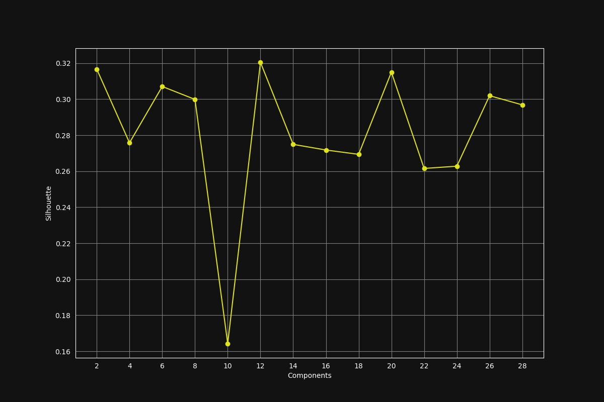

# Re: Stochastic Neighbor Embedding

This repository is designed as an educational tool, focusing on advanced machine learning techniques for:
- **Dimensionality Reduction**: Specifically leveraging t-SNE (t-distributed Stochastic Neighbor Embedding).
- **Clustering**: Using Gaussian Mixture Models (GMM) for optimal performance.

Key aspects include:
- **Feature Standardization**: Emphasizing the standardization of features for optimal clustering.
- **Visualization**: Aiding in the visualization of high-dimensional data in two- or three-dimensional spaces, making complex datasets more interpretable.

Purpose and Application:
- **Educational Nature**: Aimed at providing a foundational understanding for beginners.
- **Real Estate Applications**: Offering methods to analyze and cluster property listings by features such as square footage, number of bedrooms, bathrooms, and price.

Intent:
- **Starting Point**: Serves as a starting point intended to inspire further exploration and adaptation.
- **Encouragement for Extension**: While this guide provides a basis, there are many ways to extend and improve upon the techniques presented here.

This approach aims to make complex data sets in fields like real estate more accessible and interpretable, encouraging users to explore further and adapt the techniques to their needs.

## Applications in Real Estate

This repository's methodologies can be particularly transformative in the real estate sector by:

- **Market Segmentation**: Clustering properties into meaningful groups to better understand different market segments.
- **Price Optimization**: Analyzing clusters to identify undervalued or overvalued properties based on their features.
- **Customer Targeting**: Matching property clusters with customer preferences to improve sales strategies and targeting.
- **Trend Analysis**: Tracking changes in cluster characteristics over time to identify market trends.

## How Others Can Use This Repository

- **Researchers** can use these techniques to explore the dynamics of housing markets in different regions.
- **Real Estate Professionals** can apply this analysis to tailor their marketing strategies to specific customer segments or to price properties more accurately.
- **Data Scientists** in the real estate domain can leverage this repository to enhance their analytical capabilities, enriching their data with more nuanced insights.

## Features

- **Data Preprocessing**: Efficiently load and preprocess data to ready it for analysis.
- **Feature Standardization**: Standardize features to a 0 mean and unit variance, ensuring consistency across various scales.
- **Gaussian Mixture Model Clustering**: Utilize GMM for clustering, identifying inherent groupings within data.
- **Cluster Descriptors Calculation**: Determine mean feature values for each cluster, facilitating an understanding of cluster properties.
- **t-SNE Dimensionality Reduction**: Employ t-SNE to diminish the dimensionality of data, aiding in visualization efforts.
- **Visualization**: Create and store visualizations to elucidate the distribution and delineation of clusters.

## Quick Start

This section guides you through the initial steps to analyze your data with t-SNE and GMM for effective clustering and visualization. Follow these steps to get started:

1. **Data Preparation**:
   - Ensure your dataset is in CSV format with columns for Square Footage, Bedrooms, Bathrooms, and Price. This format is crucial for the scripts to correctly process your data.
   - Example CSV structure:
     ```
     Square Footage, Bedrooms, Bathrooms, Price
     1200, 3, 2, 250000
     1500, 4, 3, 350000
     ...
     ```

2. **Install Dependencies**:
   - Run the following command in your terminal to install all necessary Python packages listed in the `requirements.txt` file. This step ensures that you have the right environment set up for running the analysis scripts.
     ```
     pip install -r requirements.txt
     ```

3. **Provide Your Data Path**:
   - Locate the `re_gmm.py` script in the repository. You will need to modify the `process_and_output_data("sample_home_data.csv")` call within the `if __name__ == "__main__":` block at the end of the script. Replace `"sample_home_data.csv"` with the path to your dataset. For example:
     ```python
     if __name__ == "__main__":
         processed_data = process_and_output_data("path/to/your/dataset.csv")
     ```
   - This modification tells the script where to find your data file for processing.

4. **Run the Analysis**:
   - Execute the `re_gmm.py` script in your terminal. Ensure you are in the directory containing the script, then run:
     ```
     python re_gmm.py
     ```
   - The script will load your data, perform preprocessing, standardization, GMM clustering, and then calculate cluster descriptors. Finally, it appends cluster labels to your data, providing a processed dataset with insightful clustering information.


## Dependencies

This command will install all necessary Python packages listed in the requirements.txt file, including `pandas`, `numpy`, `scikit-learn`, and `matplotlib`.
`
pip install -r requirements.txt
`
## Understanding GMM vs. KMeans

Gaussian Mixture Models and KMeans are two popular clustering techniques with distinct approaches and applications:

- **GMM - Gaussian Mixture Models**:
  - **Probabilistic Model**: Assumes data points are generated from a mixture of several Gaussian distributions.
  - **Flexibility**: Accommodates clusters of different sizes and shapes.
  - **Soft Clustering**: Allows membership of data points in multiple clusters with varying degrees of probability, useful for overlapping clusters or undefined boundaries.

- **KMeans**:
  - **Centroid-Based Algorithm**: Partitions the data into k clusters, each represented by the mean of its points.
  - **Assumptions**: Assumes clusters to be spherical and equally sized, which may limit handling complex data structures.
  - **Hard Clustering**: Assigns each data point to exactly one cluster, which may not always reflect the true nature of the data.

**Choosing Between GMM and KMeans**:
- **GMM** is more suitable for datasets with overlapping clusters and non-linear cluster boundaries due to its ability to model the covariance structure of the data and provide probabilistic cluster assignments.
- **KMeans** is ideal for large datasets where computational speed is a concern and the clusters are relatively well separated and homogeneous.

## Benefits of t-SNE

t-SNE (t-distributed Stochastic Neighbor Embedding) offers significant benefits for data visualization and cluster validation:

- **Data Visualization**: Helps in the intuitive understanding and analysis of high-dimensional data by preserving local structures.
- **Revealing Hidden Patterns**: Its ability to reveal hidden patterns in data makes it an invaluable tool for exploratory data analysis.
- **Application in Real Estate**: Particularly beneficial in fields like real estate, where visualizing complex relationships between properties can lead to actionable insights.


## Visualizations

Visualizations play a crucial role in understanding and interpreting the data analysis results. Here we present two key visualizations that aid in comprehending the clustering process and the effectiveness of dimensionality reduction techniques.

### Silhouette Score vs. Components




**Context**:
- **Purpose**: This graph helps in determining the ideal number of components for Gaussian Mixture Models (GMM) clustering.
- **Silhouette Score**: Represents how similar an object is to its own cluster compared to other clusters. A higher silhouette score indicates better defined clusters.
- **Analysis**: By showcasing the silhouette score across different numbers of components, we can identify the point where the score is maximized, indicating the optimal number of clusters for the dataset.

**Significance**:
- **Optimal Clustering**: Choosing the right number of components is crucial for achieving meaningful and interpretable clustering results.
- **Insight Generation**: Helps in making informed decisions on the complexity of the model versus the interpretability and quality of the clustering.

### t-SNE Visualization


**Context**:
- **Visualization Type**: A dynamic 3D visualization that demonstrates the clustering of data points in a dimensionally reduced space.
- **t-SNE**: Stands for t-distributed Stochastic Neighbor Embedding, a technique used for dimensionality reduction to facilitate the visualization of high-dimensional datasets.

**Significance**:
- **Cluster Identification**: Through this visualization, distinct clusters formed by the data points become apparent, aiding in the intuitive understanding of data groupings.
- **Exploratory Data Analysis**: Offers a graphical representation of how data points are distributed and clustered, which can reveal patterns, outliers, and inherent structures that might not be obvious in high-dimensional space.

**Application**:
- **Real Estate Sector**: In real estate analysis, such visualizations can elucidate the relationships between properties, highlighting groups of similar properties or identifying outliers.


## Conclusion

This project integrates advanced techniques to offer powerful tools for data analysis, clustering, and visualization, making complex data sets accessible and interpretable. Our focus is particularly on real estate applications, but the methodologies are broadly applicable:

- **Data Analysis and Clustering**: Provides a structured approach to understanding complex data sets.
- **Visualization**: Enhances the ability to uncover and comprehend the underlying structures in complex datasets.

Key Takeaways:
- **Choosing the Right Clustering Approach**: The comparison between GMM and KMeans illuminates the importance of selecting the appropriate clustering technique based on data characteristics and analysis goals.
- **Dimensionality Reduction**: The inclusion of t-SNE for dimensionality reduction and visualization further empowers users to derive meaningful insights and make informed decisions.
- **Educational Resource**: Designed to get users started with these techniques, this repository encourages further exploration and adaptation.
- **Future Exploration**: There are many avenues for extending and improving upon the techniques presented here, inviting users to experiment with and adapt these methods to their unique needs and contexts.
